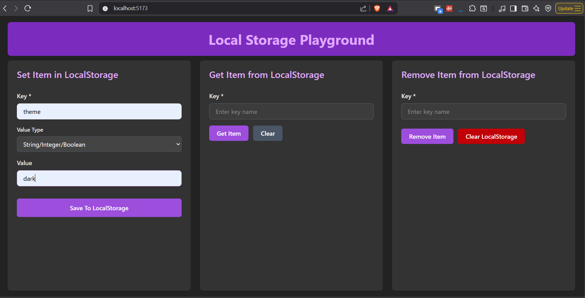
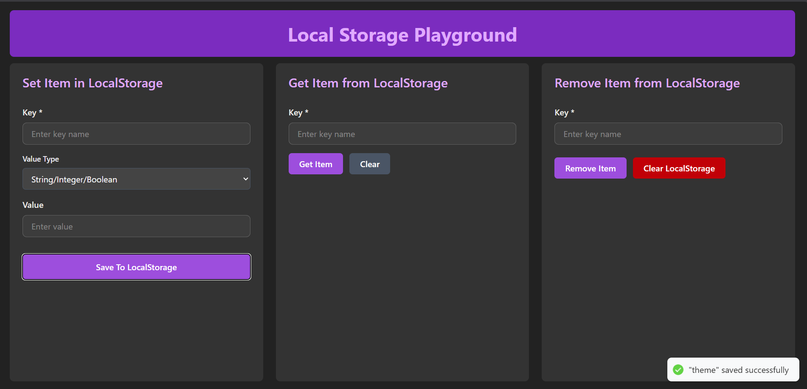
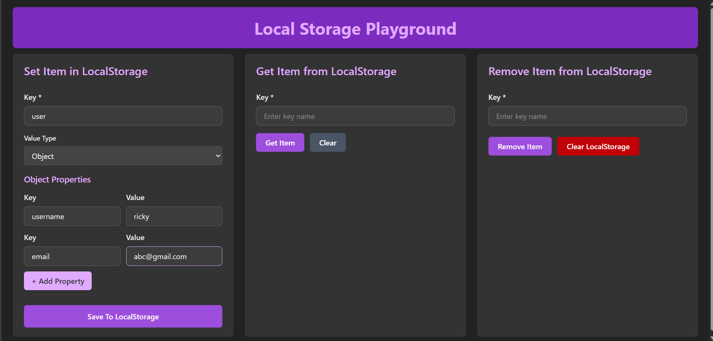
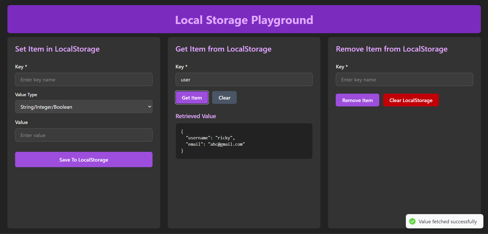
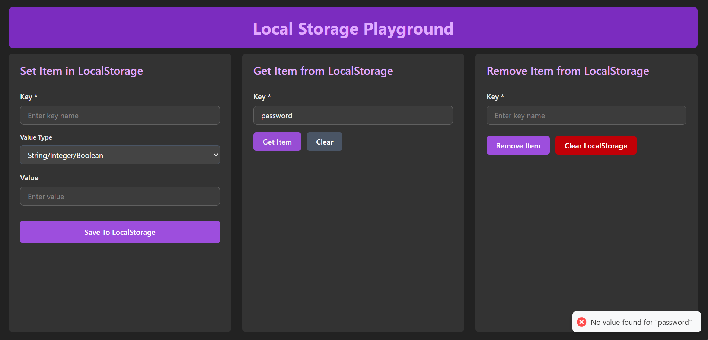
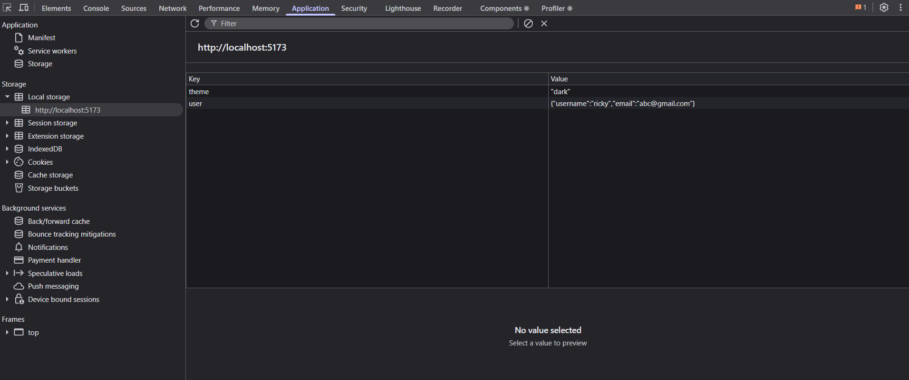
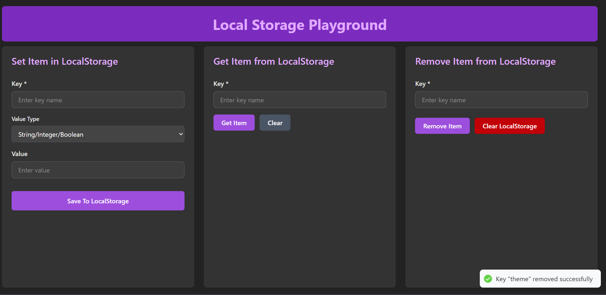
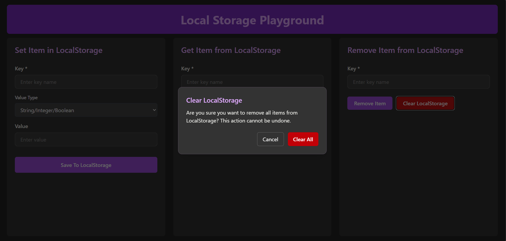

# Local Storage

* Data stored in the browser.
* It remains available even after page refreshes or browser restarts until explicitly removed.
* Can be inspected through:

  * `Inspect Element`
  * `Application`
  * `Local Storage`

---

# Local Storage Methods

### `setItem(key, value)`

* Used to store data in Local Storage.
* Both `key` and `value` are stored as strings.
* Objects and arrays should be converted using `JSON.stringify()` before storing.

```javascript
localStorage.setItem("username", "John");
```

### `getItem(key)`

* Used to retrieve data from Local Storage.
* Returns `null` if the key does not exist.

```javascript
localStorage.getItem("username");
```

### `removeItem(key)`

* Used to remove a specific item from Local Storage.

```javascript
localStorage.removeItem("username");
```

### `clear()`

* Used to remove all items from Local Storage.

```javascript
localStorage.clear();
```

---

# Local Storage Playground

This project includes an interactive **Local Storage Playground** built with React that helps understand and experiment with Local Storage operations visually.

The playground provides:

* Add items to Local Storage.
* Store primitive values (String, Integer, Boolean).
* Store Objects.
* Store Arrays.
* Retrieve stored items.
* Remove specific items.
* Clear the entire Local Storage.
* Success and error toast notifications.
* Real-time inspection through browser DevTools.

---

# Features

## 1. Add Item

Store primitive values in Local Storage by providing a key and value.

**Screenshot**



---

## 2. Item Added Successfully

After successful insertion, a toast notification confirms that the item has been stored.

**Screenshot**



---

## 3. Store Objects

Create dynamic key-value pairs and store complete JavaScript objects in Local Storage.

**Screenshot**



---

## 4. Get Item

Retrieve any stored item using its key.

**Screenshot**



---

## 5. Handle Missing Keys

Displays an error toast when attempting to retrieve a key that does not exist.

**Screenshot**



---

## 6. View Stored Items

Inspect stored items directly from the browser's Application tab.

**Screenshot**



---

## 7. Remove Item

Remove a specific item using its key.

**Screenshot**



---

## 8. Clear All Items

Remove all Local Storage entries using the clear functionality with a confirmation modal.

**Screenshot**



---

# Concepts Covered

* Browser Storage APIs
* Local Storage CRUD Operations
* JSON Serialization (`JSON.stringify`)
* JSON Deserialization (`JSON.parse`)
* React State Management
* Controlled Components
* Dynamic Forms
* Conditional Rendering
* Toast Notifications
* Confirmation Modals

---

# Tech Stack

* React
* JavaScript (ES6+)
* Tailwind CSS
* React Hot Toast

---

# Learning Outcome

By using this playground, you can understand:

* How Local Storage works internally.
* How different data types are stored.
* Why objects and arrays require serialization.
* How to retrieve and parse stored data.
* Best practices for managing browser storage in React applications.
